## 现代密码学Lab1

### 第一部分 Enigma攻击

选择了已知明密文的攻击算法

#### 算法原理

- 从明密文中得到环，用一个dict保存。key是字母，value是list of list of id, 表示以这个字母为开头字母的全部环。

  > 环组：dict中每个key对应的全部环，称为一个环组
  
- ```
  遍历rotor的排列: 
  	遍历rotor初始位置:
  		遍历环组：
  			遍历一个环组中的全部环：
  				遍历S(E):
  					维护对当前环成立的插线板映射
  				维护对当前环组成立的插线板映射（取交集）
  		维护对所有环组成立的插线板映射（取并集）
  		最终获得对于当前rotor排列和初始位置下，可能的插线板映射。
  ```

- 逐一检验step2中得到的初步结果，若`engima(ptext) = ctext`, 则成功找到一组解。			


#### 实际样例的攻击过程

##### 样例

> 说明：测试样例来自计84班黄昱炜同学

```
rotor排列：3, 0, 2
rotor初始位置: 21, 6, 14
plugboard: O<->U, D<->Z, B<->T
ptext: 'TODAYISANICEDAYBUTMYHOMEWORKHASNOTFINISHED'
ctext: 'AAVRDVLBXJDMYIVVLWCLUDKSKQSHCUWQTLBVDBQEPO'
```

##### 中间过程

环

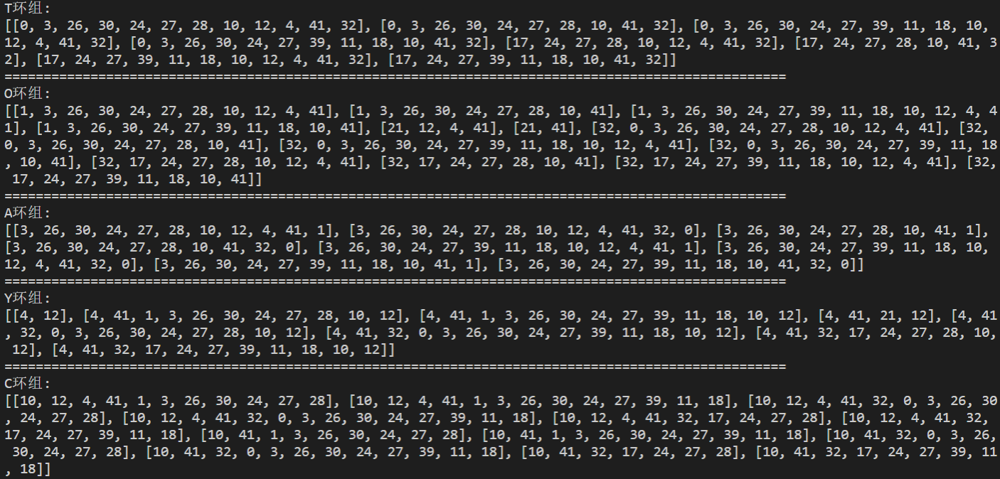

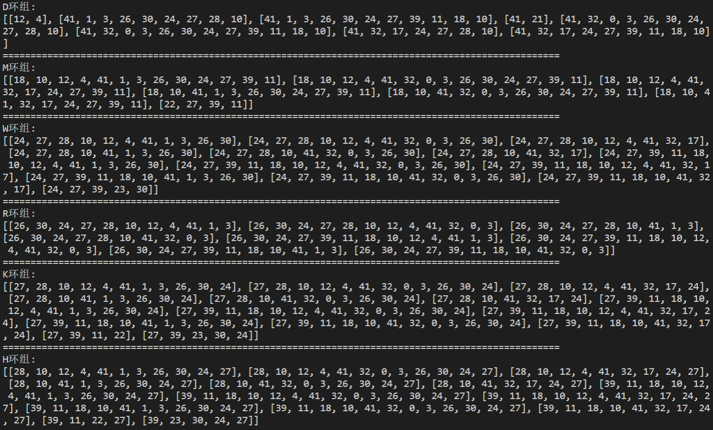

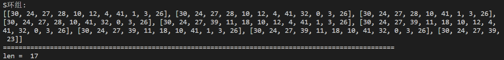

遍历

- 用了multiprocess
- 打表加速了一下

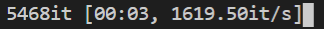

初步结果（未做最后的筛选）

> 每个item的格式是: [rotor初始位置，rotor顺序，插线板设置]

```
[
	[302, (3, 2, 4), {('A', 'I'), ('Q', 'R'), ('I', 'A'), ('R', 'Q')}],
	[423, (0, 1, 3), {('K', 'R'), ('V', 'A'), ('A', 'V'), ('R', 'K')}],
	...
]
```

#### 结果

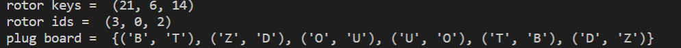

#### 代码文档

文件：`lab1.py`

类说明：

- Rotor类: 转轮，主要方法有
  - `forward`：对应加密过程的正向
  - `backward`, 对应加密过程的反向
- Enigma类: Enigma机，主要方法有
  - `set_param`: 设置转轮顺序，初始位置，插线板
  - `__call__`: 加密一个字符串
- Cracker类: 破解类，主要方法有
  - `parse`: 从明密文中提取环
  - `crack`: 破解明密文

### 第二部分

#### 1.5

遍历所有可能

```python
def crack(text):
    for offset in range(26):
        temp = [chr((ord(i) - ord('A') + offset) % 26 + ord('A')) for i in text]
        print(''.join(temp))

crack('BEEAKFYDJXUQYHYJIQRYHTYJIQFBQDUYJIIKFUHCQD')
```


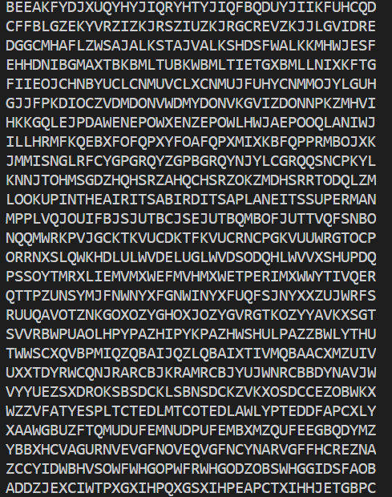

通过观察得到结果：

look up in the air its a bird its a plane its superman

#### 1.16

（1）

| x             | 1    | 2    | 3    | 4    | 5    | 6    | 7    | 8    |
| ------------- | ---- | ---- | ---- | ---- | ---- | ---- | ---- | ---- |
| $\Pi^{-1}(x)$ | 2    | 4    | 6    | 1    | 8    | 3    | 5    | 7    |

（2）

> m指明文分块的单位长度

```python
a = [4, 1, 6, 2, 7, 3, 8, 5]
step = len(a)

def crack(text):
    def func(chunk):
        temp = [ chunk[a[i]-1] for i in range(len(chunk))]
        return ''.join(temp)      
    result = ''
    for i in range(0, len(text), step):
        result += func(text[i: i+step])
    print(result)

crack('ETEGENLMDNTNEOORDAHATECOESAHLRMI')
```

得到结果`GENTLEMENDONOTREADEACHOTHERSMAIL`

即gentlemen do not read each others mail

#### 1.21

##### (a)

- 代换F->w

- 统计单字词频

```python
text =  "EMGLOSUDCGDNCUSWYSFHNSFCYKDPUMLWGYICOXYSIPJCKQPKUGKMGOLICGINCGACKSNISACYKZSCKXECJCKSHYSXCGOIDPKZCNKSHICGIWYGKKGKGOLDSILKGOIUSIGLEDSPWZUGFZCCNDGYYSFUSZCNXEOJNCGYEOWEUPXEZGACGNFGLKNSACIGOIYCKXCJUCIUZCFZCCNDGYYSFEUEKUZCSOCFZCCNCIACZEJNCSHFZEJZEGMXCYHCJUMGKUCY"

def preprocess(text):
    keymap = {'F': 'W'}
    for k, v in keymap.items():
        text = text.replace(k, v)  
    return text

text = preprocess(text)
print(text)

result = {}
for i in range(26):
    char = chr(ord("A") + i)
    result[char] = text.count(char) / len(text)

result = sorted(result.items(), key=lambda x: x[1])
for i in result[::-1]:
    print(i)
```

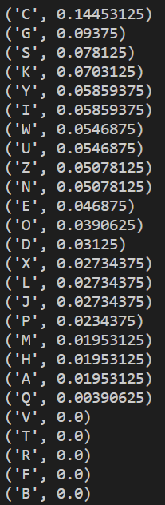

结合下图，推测C->E 

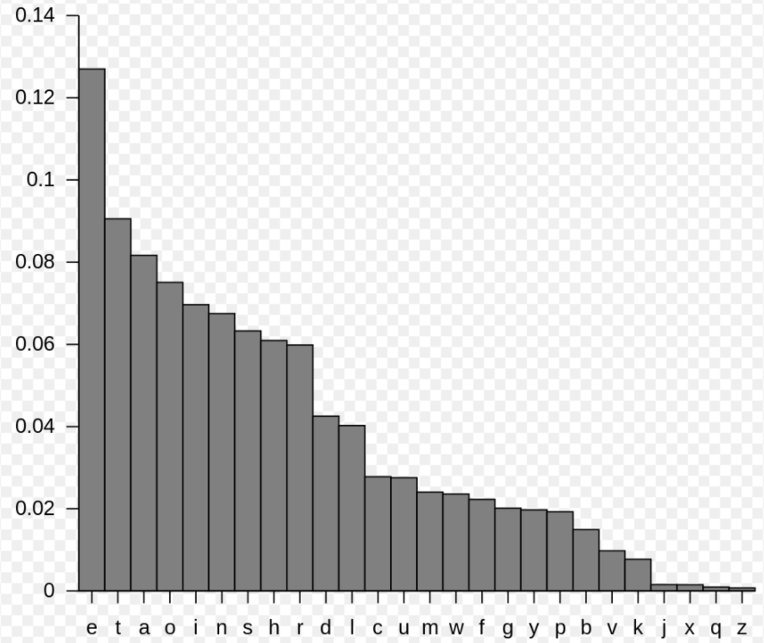

```
EMGLOSUDEGDNEUSWYSWHNSWEYKDPUMLWGYIEOXYSIPJEKQPKUGKMGOLIEGINEGAEKSNISAEYKZSEKXEEJEKSHYSXEGOIDPKZENKSHIEGIWYGKKGKGOLDSILKGOIUSIGLEDSPWZUGWZEENDGYYSWUSZENXEOJNEGYEOWEUPXEZGAEGNWGLKNSAEIGOIYEKXEJUEIUZEWZEENDGYYSWEUEKUZESOEWZEENEIAEZEJNESHWZEJZEGMXEYHEJUMGKUEY
```

- 注意到被已知的替换(F->W, C->E)处理过的字符串中，出现了多次`WZEEN`, 其中W和E都是明文。推测对应单词wheel, 即Z->H, N->L

```
EMGLOSUDEGDLEUSWYSWHLSWEYKDPUMLWGYIEOXYSIPJEKQPKUGKMGOLIEGILEGAEKSLISAEYKHSEKXEEJEKSHYSXEGOIDPKHELKSHIEGIWYGKKGKGOLDSILKGOIUSIGLEDSPWHUGWHEELDGYYSWUSHELXEOJLEGYEOWEUPXEHGAEGLWGLKLSAEIGOIYEKXEJUEIUHEWHEELDGYYSWEUEKUHESOEWHEELEIAEHEJLESHWHEJHEGMXEYHEJUMGKUEY
```

- 注意被替换过的H,E，这些位置已经确定，UHE出现次数最多，推测U->E

```
EMGLOSTDEGDLETSWYSWHLSWEYKDPTMLWGYIEOXYSIPJEKQPKTGKMGOLIEGILEGAEKSLISAEYKHSEKXEEJEKSHYSXEGOIDPKHELKSHIEGIWYGKKGKGOLDSILKGOITSIGLEDSPWHTGWHEELDGYYSWTSHELXEOJLEGYEOWETPXEHGAEGLWGLKLSAEIGOIYEKXEJTEITHEWHEELDGYYSWETEKTHESOEWHEELEIAEHEJLESHWHEJHEGMXEYHEJTMGKTEY
```

- 为了更加方便观察，将已确定的位置用小写字母表示，未确定的位置用大写字母表示

```
EMGLOStDeGDletSWYSwHlSweYKDPtMLWGYIeOXYSIPJeKQPKtGKMGOLIeGIleGAeKSlISAeYKhSeKXEeJeKSHYSXeGOIDPKhelKSHIeGIWYGKKGKGOLDSILKGOItSIGLEDSPWhtGwheelDGYYSwtShelXEOJleGYEOWEtPXEhGAeGlwGLKlSAeIGOIYeKXeJteIthewheelDGYYSwEtEKtheSOewheeleIAehEJleSHwhEJhEGMXeYHeJtMGKteY
```

- 注意到theSOewheel, 推测为the one wheel, 即S->o, O->n

```
EMGLnotDeGDletoWYowHloweYKDPtMLWGYIenXYoIPJeKQPKtGKMGnLIeGIleGAeKolIoAeYKhoeKXEeJeKoHYoXeGnIDPKhelKoHIeGIWYGKKGKGnLDoILKGnItoIGLEDoPWhtGwheelDGYYowtohelXEnJleGYEnWEtPXEhGAeGlwGLKloAeIGnIYeKXeJteIthewheelDGYYowEtEKtheonewheeleIAehEJleoHwhEJhEGMXeYHeJtMGKteY
```

- 注意到to helX, 推测为to help, 即X->p

```
EMGLnotDeGDletoWYowHloweYKDPtMLWGYIenpYoIPJeKQPKtGKMGnLIeGIleGAeKolIoAeYKhoeKpEeJeKoHYopeGnIDPKhelKoHIeGIWYGKKGKGnLDoILKGnItoIGLEDoPWhtGwheelDGYYowtohelpEnJleGYEnWEtPpEhGAeGlwGLKloAeIGnIYeKpeJteIthewheelDGYYowEtEKtheonewheeleIAehEJleoHwhEJhEGMpeYHeJtMGKteY
```

- 注意到Yope, loweY, 推测Y->r

```
EMGL not DeGDle to WrowH lowerKDPtMLWGrIenproIPJeKQPKtGKMGnLIeGIleGAeKolIoAerKhoeKpEeJeKoH rope GnIDPKhelKoHIeGIWrGKKGKGnLDoILKGnItoIGLEDoPWhtG wheel DGrrow to help EnJleGrEnWEtPpEhGAeGlwGLKloAeIGnIreKpeJteI the wheel DGrrow EtEK the one wheeleI AehEJleoHwhEJhEGMperHeJtMGKter
```

- 注意到wheeleI, 推测I->d

```
EMGLnotDeGDletoWrowHlowerKDPtMLWGrdenprodPJeKQPKtGKMGnLdeGdleGAeKoldoAerKhoeKpEeJeKoHropeGndDPKhelKoHdeGdWrGKKGKGnLDodLKGndtodGLEDoPWhtGwheelDGrrowtohelpEnJleGrEnWEtPpEhGAeGlwGLKloAedGndreKpeJtedthewheelDGrrowEtEKtheonewheeledAehEJleoHwhEJhEGMperHeJtMGKter
```

- 注意到not DeGDle to , 推测D->b, G->a(词频也比较对应)

```
EMaL not be able to WrowHlowerKbPtMLWarden prodPJeKQPKtaKManLdeadleaAeKoldoAerKhoeKpEeJeKoHropeandbPKhelKoHdeadWraKKaKanLbodLKandtodaLEboPWhtawheelbarrowtohelpEnJlearEnWEtPpEhaAealwaLKloAedandreKpeJtedthewheelbarrowEtEKtheonewheeledAehEJleoHwhEJhEaMperHeJtMaKter
```

- 注意到Warden, 推测W->g

```
EMaL not be able to growHlowerKbPtML garden prodPJeKQPKtaKManL dead leaAeKoldoAerKhoeKpEeJeKoHrope and bPKhelKoH dead graKK aK anLbodLKandtodaLEboPghtawheelbarrowtohelpEnJlearEngEtPpEhaAealwaLKloAedandreKpeJted the wheel barrowEtEK the one wheeled AehEJleoHwhEJhEaMperHeJtMaKter
```

- 注意到graKK, 以及K的词频较高，剩余字母中可能对应的是s, 推测K->s

```
EMaL not be able to grow HlowersbPtML garden prodPJesQPstasManL dead leaAes old oAershoespEeJesoH rope and bPshelsoH dead grass as anLbodL sandtodaLEboPghtawheelbarrowtohelpEnJlearEngEtPpEhaAealwaLsloAedandrespeJtedthewheelbarrowEtEstheonewheeledAehEJleoHwhEJhEaMperHeJtMaster
```

- 注意到anLbodL, 推测L->y

```
EMay not be able to grow HlowersbPtMy garden prodPJesQPst as Many dead leaAes old oAershoespEeJesoH rope and bPshelsoHdeadgrass as anybodys and today EboPghta wheel barrow to help EnJlearEngEtPpEhaAe always loAed and respeJtedthewheelbarrowEtEstheonewheeledAehEJleoHwhEJhEaMperHeJtMaster
```

- 注意到Many->many,  loAed -> loved, 即M->m, A->v

```
E may not be able to grow Hlowers bPt my garden prodPJesQPst as many dead leaves oldovershoespEeJesoH rope and bPshelsoH dead grass as anybodys and today EboPghta wheel barrow to help EnJlearEngEtPpE have always loved and respeJted the wheel barrow EtEs the one wheeled vehEJleoHwhEJhEamperHeJt master
```

- 注意到Hlowers->flowers, bPt->but,respeJted->respected, E->I, 即H->f, P->u, J->c, E->i

```
i may not be able to grow flowers but my garden produces Qust as manydeadleavesoldovershoespiecesofropeandbushelsofdeadgrassasanybodysandtodayiboughtawheelbarrowtohelpinclearingitupihavealwayslovedandrespectedthewheelbarrowitistheonewheeledvehicleofwhichiamperfectmaster
```

- 注意到Qust -> just, 即Q->j

```
i may not be able to grow flowers but my garden produces just as many dead leaves old overshoes pieces of rope and bushels of dead grass as anybodys and today i bought a wheel barrow to help inclearing it up i have always loved and respected the wheel barrow it is the one wheeled vehicle of which i am perfect master
```

解密完毕

##### (b)

- 首先推测密钥长度，利用重合指数

```python
text = "KCCPKBGUFDPHQTYAVINRRTMVGRKDNBVFDETDGILTXRGUDDKOTFMBPVGEGLTGCKQRACQCWDNAWCRXIZAKFTLEWRPTYCQKYVXCHKFTPONCQQRHJVAJUWETMCMSPKQDYHJVDAHCTRLSVSKCGCZQQDZXGSFRLSWCWSJTBHAFSIASPRJAHKJRJUMVGKMITZHFPDISPZLVLGWTFPLKKEBDPGCEBSHCTJRWXBAFSPEZQNRWXCVYCGAONWDDKACKAWBBIKFTIOVKCGGHJVLNHIFFSQESVYCLACNVRWBBIREPBBVFEXOSCDYGZWPFDTKFQIYCWHJVLNHIQIBTKHJVNPIST"


def cal_ci(text):
    if len(text) == 1:
        return 0

    fs = []
    for i in range(26):
        char = chr(ord("A") + i)
        fs.append(text.count(char))
    fs = [i * (i-1) for i in fs]
    n = len(text)
    ci = sum(fs) / (n * (n - 1))
    return ci

def cal_text(text):
    for m in range(3, 10):
        result = []
        
        for i in range(m):
            result.append(cal_ci(text[i::m]))
        print('m = ', m)
        print('ci = ', result)
        print('='*100)

cal_text(text)
```

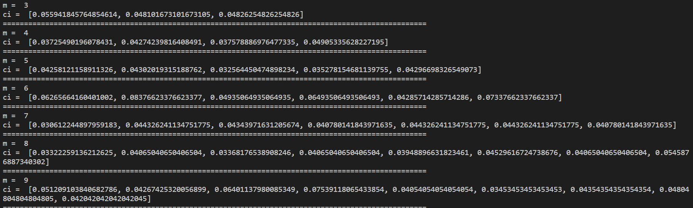

推测m=6

- 接下来计算密钥。

  我试了用卡方、cosine，来衡量字串分布和真实分布的相似度，但都fail了，感觉是子串太短了，分布不真实，还是遍历，用重合指数最后筛选。阈值设为0.065

  为了减小dfs的空间，假设每个子串中频率最高的字母，对应真实分布中，频率最高的前6个字母。

  ```python
  import numpy as np
  
  text = "KCCPKBGUFDPHQTYAVINRRTMVGRKDNBVFDETDGILTXRGUDDKOTFMBPVGEGLTGCKQRACQCWDNAWCRXIZAKFTLEWRPTYCQKYVXCHKFTPONCQQRHJVAJUWETMCMSPKQDYHJVDAHCTRLSVSKCGCZQQDZXGSFRLSWCWSJTBHAFSIASPRJAHKJRJUMVGKMITZHFPDISPZLVLGWTFPLKKEBDPGCEBSHCTJRWXBAFSPEZQNRWXCVYCGAONWDDKACKAWBBIKFTIOVKCGGHJVLNHIFFSQESVYCLACNVRWBBIREPBBVFEXOSCDYGZWPFDTKFQIYCWHJVLNHIQIBTKHJVNPIST"
  
  m = 6
  
  keys = [-1] * m
  text_ids = np.array([(ord(i) - ord('A')) for i in text])
  result = np.zeros_like(text_ids)
  
  real_max = [ord(x) - ord('A') for x in ['E', 'T', 'A', 'O', 'I', 'N']]
  sample_max = [ord(x) - ord('A') for x in ['Q', 'K', 'L', 'T', 'H', 'C']]
  
  def dfs(id):
      if id == 6:
          temp_text = ''.join([chr(i + ord('A')) for i in result])
          score = cal_ci(temp_text)
          if score < 0.065:
              return 
          else: # 一个可能的key
              print('keys = ', ''.join([chr(i + ord('A')) for i in keys]))
              print('ptext = ', ''.join([chr(i + ord('A')) for i in result]))
              print('='*100)
              return 
      for i in real_max:
          keys[id] = (26 - i + sample_max[id]) % 26
          result[id::m] = (text_ids[id::m] - sample_max[id] + i + 26) % 26
          dfs(id + 1)
  
  dfs(0)
  ```

  搜到结果

  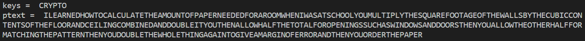

##### (c)

统计词频

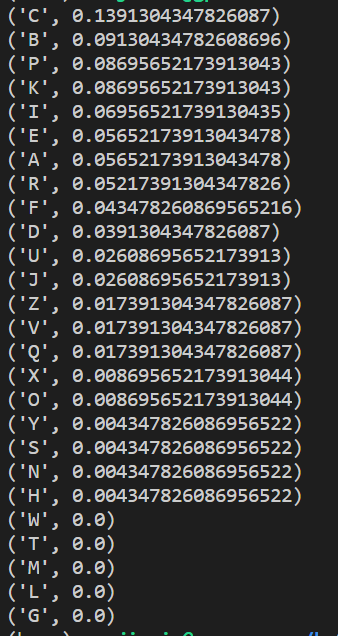

推测C->E, B->T

即(2a + b) % 26 = 4 , (a + b) % 26 = 19

解得a=11, b=8

进一步获得明文

```python
result = [chr(((ord(i) - ord('A')) * 11 + 8) % 26 + ord('A')).lower() for i in text]
print(''.join(result))
```

```
ocanadaterredenosaieuxtonfrontestceintdefleuronsglorieuxcartonbrassaitporterlepeeilsaitporterlacroixtonhistoireestuneepopeedesplusbrillantsexploitsettavaleurdefoitrempeeprotegeranosfoyersetnosdroits
```

##### (d)

- 首先统计单词频率，应该是代换。考虑vigenere， 用(b)的代码尝试

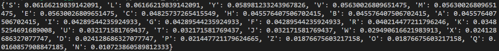

- 推测m=6, 得到初步结果

  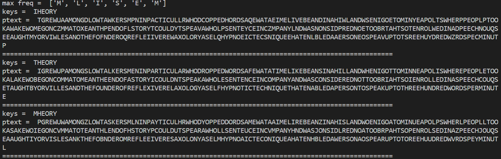

- 根据观察，keys应该是THEORY, ptext如图所示

#### 1.26

(1)

```python
def decode(text, m, n):
    result = ''
    chunk = m * n
    for j in range(0, len(text), chunk):
        for i in range(n):
            result += text[j: j+chunk][i::n]
    print(result)

decode('ctaropyghpry', 4, 3)
```

(2)

长度42, m=3, n=2是合理解

使用(1)方法,  得到明文:

```
marymaryquitecontraryhowdoesyourgardengrow
```

