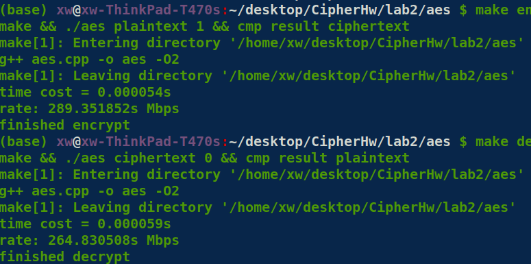
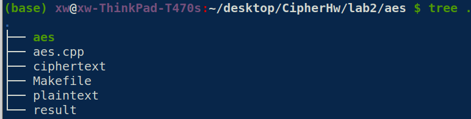
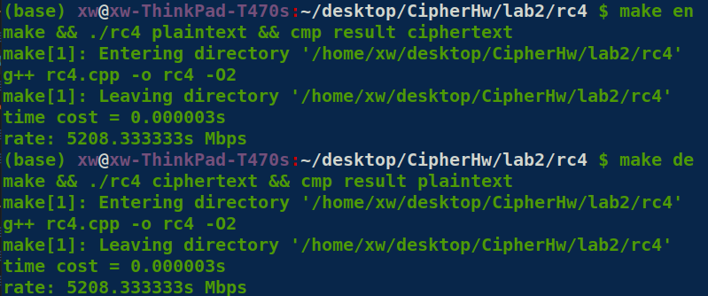
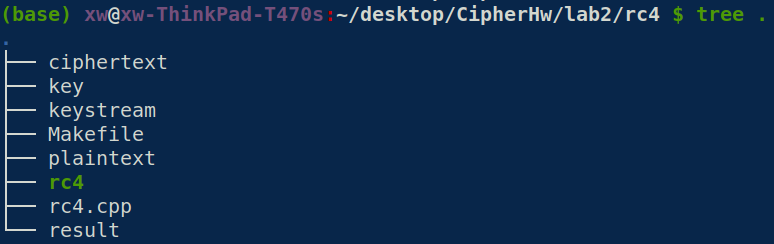
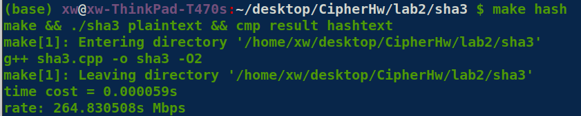
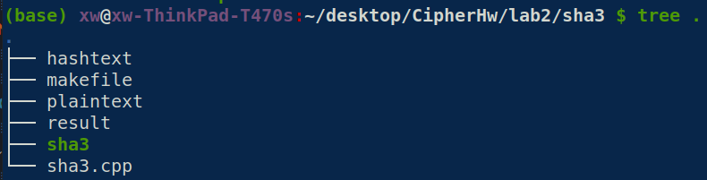

## 现代密码学第二次大作业报告

### AES

#### 实现优化细节

除了使用static这类小优化以外，主要的优化还是在于打表。

具体来说，以加密为例，AES-128加密过程中会多次调用subbytes, shiftrows, mixcolumns, addroundkey。其中

- Sbox可以预先算出
- mix_columns的mixarray固定，因此在gf域上和8bit以内所有数的乘积结果也可以预先算出。

这时测试性能已经足够，就没有继续做loop unrolling等优化了。

#### 性能

#### 测试案例和实验结果

目录下已有一对儿明密文，`ciphertext`和`plaintext`。

执行`make en`即可完成加密和测试

执行`make de`即可完成解密和测试

加密或解密的结果保存在`result`（硬编码）

### RC4

#### 实现优化细节

只做了基本实现：先初始化S盒，再根据PRGA算法，生成密钥流，通过异或完成加解密。

#### 性能

#### 测试案例和实验结果

类似的，目录下已有一对儿明密文:`ciphertext`, `plaintext`，以及一个初始密钥`key`.

执行`make en`即可完成加密和测试

执行`make de`即可完成解密和测试

加密或解密的结果保存在`result`，生成的密钥流保存在`keystream`（均为硬编码）

### SHA3-256

#### 实现优化细节

sha3-256的关键算法是keccak，过程中会多轮调用theta, rho, pi, chi, iota函数.

主要做的优化有两点

- rho和pi的结合。

   这一点优化想法来自于查阅资料时的一份实现，我与计84班的黄昱炜同学讨论后均采用了这一种优化方法。

  具体来说

  - rho函数过程中按照: (x,y) -> (y, (2x+3y) mod 5)的映射迭代
  - pi函数过程中用((x+3y) mod 5, x) -> (x, y)的映射更新值

  而在mod 5的意义下，(x, y) -> (y, 2x + 3y)的逆映射即是(x + 3y, x)。

  因此我们可以将二者结合，在一次遍历中实现: 在rho函数迭代的过程中，缓存上一个值用来更新。

- 打表

  循环位移的offset, 迭代的id序列都可以提前算出。

#### 性能

#### 测试案例和实验结果

类似的，目录下已有一对儿:`plaintext`, `hashtext`

执行`make hash`即可完成hash和测试

结果保存在`result`（硬编码）

