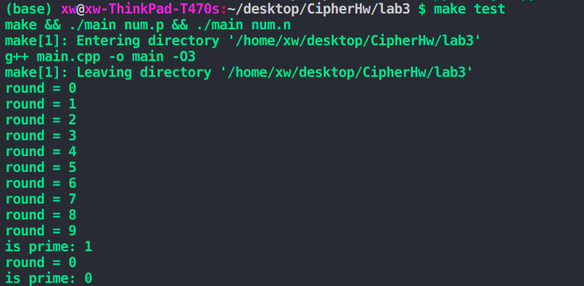

## 现代密码学第三次大作业报告

### 实现

#### 高精度

实现了`BigInt`类

以32bit为单位进行维护，为了方便写运算，用一个`uint64_t`的数组来维护。

重载了miller rabin算法过程中需要用到的所有运算符。

用快速幂算法实现了power(a, b, c)函数用于计算$(a^b)\%c$。

#### Miller-Rabin算法

涉及到的函数有两个

##### bool miller_rabin(int* n)

大致流程如下

- 生成一个随机数a
- 将`n - 1`表示为$m \times 2^k$
- 首先计算$a^m$, 若为1或-1, 平方一次后便一直为1, 满足fermat检验和平方根检验，直接返回true
- 迭代k轮
  - 平方, 再mod n
  - 若结果为1, 不满足平方根检验，返回false
  - 若结果为-1, 此后会一直满足fermat检验和平方根检验, 返回true
  - 若为其他值则继续

##### bool check(int* num, int round)

每轮调用一次`miller_rabin`算法，若重复round次都判定为true, 则认为是复数。

实验中取round=10

### 测试

#### 测例

用python生成一个素数测例`num.p`, 一个非素数测例`num.n`, 已放在目录下

#### 测试

运行make test即可

